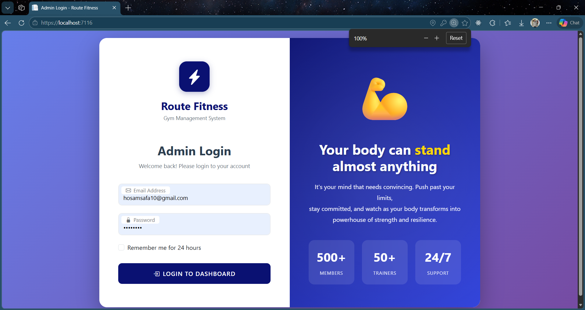
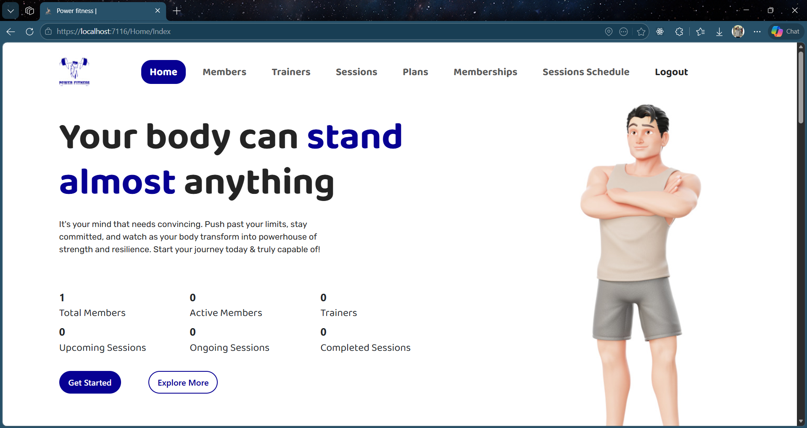
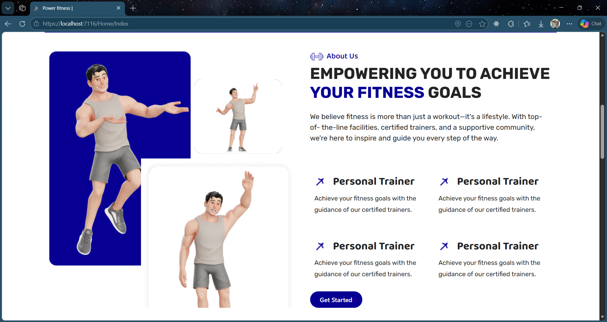
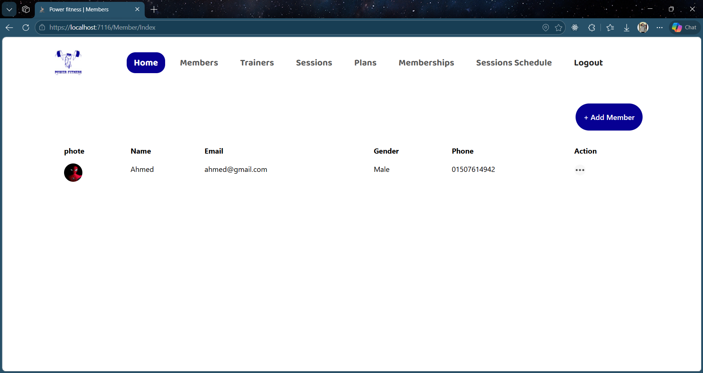
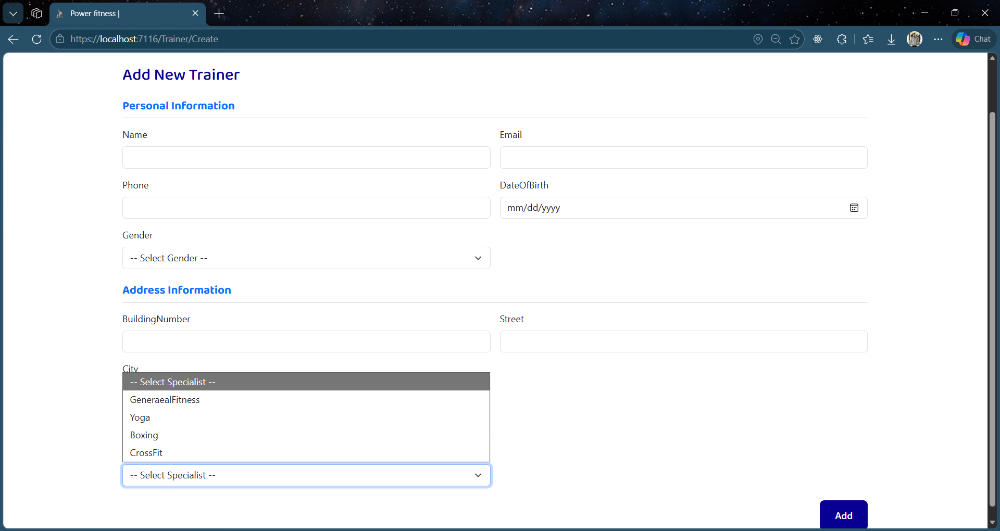
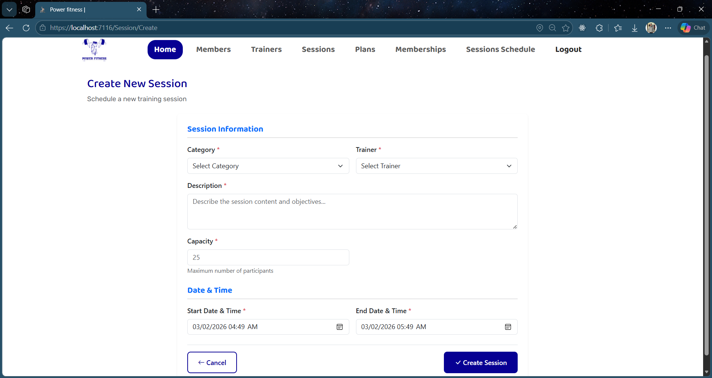

# 🏋️‍♂️ Gym Management System

A full-featured **Gym Management System** built with **ASP.NET MVC**, **Entity Framework Core**, and **SQL Server**, following a clean layered architecture and enforcing real-world business logic validation.

This project demonstrates strong backend development fundamentals including separation of concerns, data access patterns, and business rule implementation, with a modern and clean admin dashboard UI.

---

## 🚀 Features

- Manage **Members, Trainers, Sessions, and Subscriptions**
- Full **CRUD operations** with server-side validation
- Session scheduling with real-world business logic constraints
- Dashboard with real-time statistics
- **Authentication & Authorization** (Admin-only access)
- Manage Admins with roles (**Admin / SuperAdmin**)
- Clean separation using **Layered Architecture (PL / BLL / DAL)**

---

## 🛠️ Technologies Used

- ASP.NET MVC  
- Entity Framework Core  
- SQL Server  
- LINQ  
- AutoMapper  
- Bootstrap  

---

## 🧱 Architecture

### 📌 Presentation Layer (PL)
- MVC Controllers & Views  
- Handles HTTP requests and UI rendering only  

### 📌 Business Logic Layer (BLL)
- Application Services  
- Business Rules & Validations  

### 📌 Data Access Layer (DAL)
- Repositories  
- EF Core DbContext & Database Access  

---

# 📸 Screenshots

## 🔐 Authentication & Login

  

---

## 📊 Dashboard & Analytics

  
  

---

## 👥 Members & Trainers Management

  
  

---

## 🗓 Sessions & Plans

  
  

---
